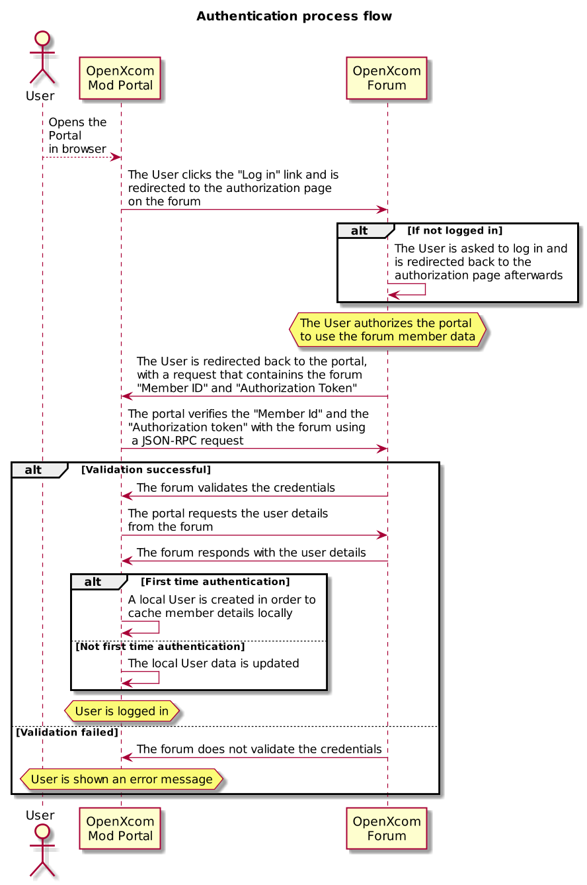
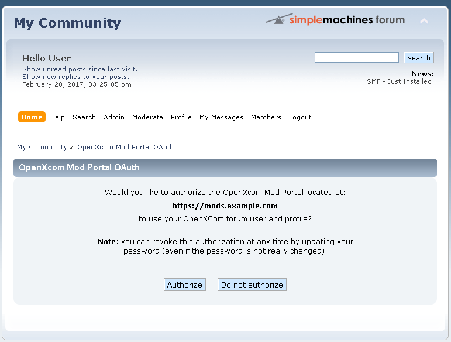

# Users System

## Overview

The users system is required for proper portal operation. Unlike a "classic"
users system which stores the users locally and independently from other
systems, the portal uses the **OpenXcom Forum** members as users.

This system allows any OpenXcom Forum member to use the mod portal by simply
authorizing the mod portal to use his/hers forum member data.

Integration with the OpenXcom Forum is achieved via a custom mod for the SMF
software that powers the OpenXcom Forum, named **OpenXcom Mod Portal OAuth**.

As the name suggests, this mod allows for a OAuth-like protocol to be used by
the portal to directly use the forum member accounts as local users.

## Authentication flow

The authentication flow is detailed in the following diagram:

## Local member data cache

The User data is cached locally in the `User` table. This includes most of the
user display data, if the user is an Administrator and the avatar URL:

* Forum ID (member ID)
* Real name (the display name, which may differ from the username)
* Administrator status
* Avatar URL

The administrator status carries over from the Forum, and it allows for
moderation and editing of various content across the mod portal, regardless of
ownership.

Other details, like the member signature, are not used by the Portal, and are
not stored in the database.

### Keeping the local user data up to date

The OpenXcom forum does not notify when a user data changes, since this would
require a process that would _guarantee_ the notification delivery to the
Portal.

This considered, the portal needs to periodically query the forum to:

* Re-verify the authentication token
* Refresh the user details

The authentication token is re-verified periodically, for as long as an user
is active on the mod portal.

The user details are refreshed periodically, for as long as the user data needs
to be displayed on the mod portal, for example when a mod authored by this
user is viewed by someone else.

## Don't flood the forum

To avoid overwhelming the OpenXcom forum with requests and slowing down the
portal while waiting for responses, the `Users` table holds the last date and
time when the respective information was last updated.

This, combined with configurable delays on how log to wait before re-checking
the user data will help providing a smooth user experience without overloading
the OpenXcom forum with sync requests.

Furthermore, where possible, the portal will make batch requests when requesting
details for multiple users.

The default delays are:

* Authentication token: 15 minutes
* User data: 120 minutes

## Implementation details

### URLs

There are several URLs that are used for authorization mechanism and and for API
access.

| Application    | Purpose                  | URL                                                        |
| -------------- | ------------------------ | ---------------------------------------------------------- |
| OpenXcom Forum | Authorization page       | https://<forum.url>/index.php?action=oxcmpoauth            |
| Mod Portal     | Authorization return URL | https://<portal.url>/login/<user.id>/<authorization.token> |
| OpenXcom Forum | API access point         | https://<forum.url>/OxcMpOauth.php                         |

#### Authorization page

This is the page that a user is sent to after clicking the "Log in" link in the
Portal interface. It will look like this:

From here, the user can authorize the Portal to use his/her forum profile.

#### Authorization return URL

After authorizing the Portal, the user is redirected here. Once redirected,
two things will immediately happen internally:

1. The UserId and AuthenticationToken are internally stored in the session data.
2. The user is immediately redirected to the
`https://<portal.url>/authorization/` URL.

The purpose of this swap (moving the data from the URL to the session) is two
fold:

1. Avoid revealing too much technical information to the user.
1. Improve security by not presenting said data, as a user may be tricked
into revealing it.

Afterwards, the UserId and AuthenticationToken are verified with the Forum,
and if valid the user will be authenticated.

#### API access point

This is where the JSON-RPC requests are sent to. It may be protected with the
HTTP Basic Authorization mechanism.

### Additional notes

1. When the user accesses the confirmation URL, the token will not be
re-verified with the forum if it's the same as the one stored in the database
and the last token validation is within the configured delay.
1. The user details are refreshed on login, but only if the authentication
token was re-verified with the forum.