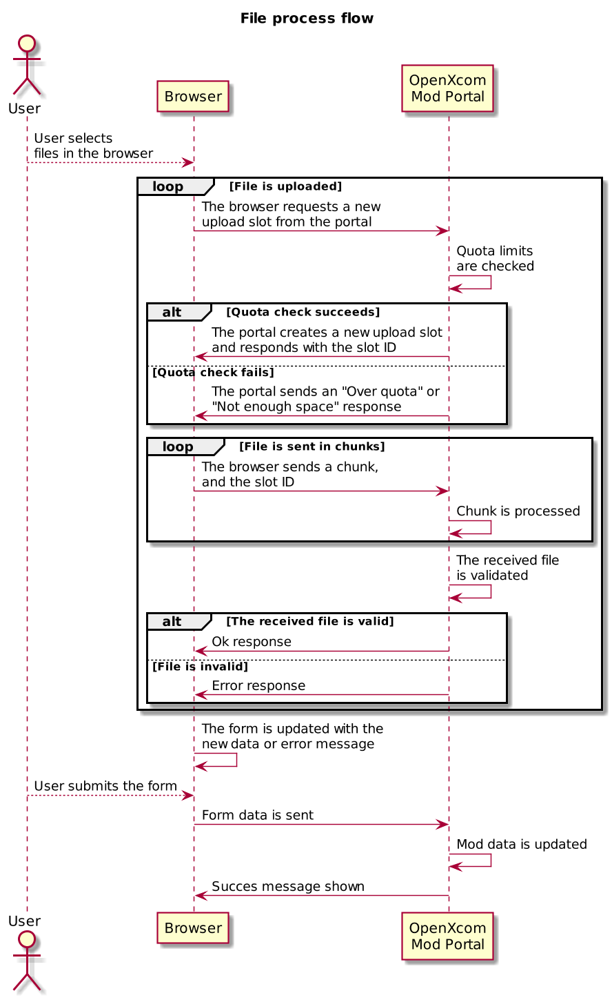

# Mod Management

## Overview

Mod management is the pivotal feature of the Portal.

Since mods are the primary resource offered by (and sought on) the Portal, mod management must be easy and intuitive
for the mod authors.

## Mod description

A mod is composed of several elements, some being editable, and some not. They are detailed below.

### Editable properties

* **Name**: This is the mod name, and the standard searches are done on this field only.
* **Summary**: A brief description of the mod.
* **Published**: If the mod is published. Mods that are not published will be visible only to their authors (and to
  administrators). Useful when making large changes to a mod.
* **Description**: This is pretty self-describing.
* **Gallery**: A visual presentation of the mod. Optional.
* **Tags**: A list of tags associated with the mod, used to place it in one or more categories.
* **Files**: One or more files that compose the actual mod, which can be downloaded.
* **Order**: The order in which images and files are listed.
* **Background**: Customized background that provides some eye-candy for the mod. Template provided. Optional.


### Non-editable properties
The values below are not directly editable by the mod author, though some are automatically adjusted as the author
and/or other users interact with a mod.

* **UUID**: The mod's universal unique identifier, used to aggregate mod data.
* **User ID**: Who owns the mod.
* **Slug**: The unique "friendly URL" of the mod. It is automatically derived from the title when the mod
  is created.
* **Date created**: Date and time when the mod was created.
* **Date updated**: Date and time when the mod was updated.
* **Rating Up**: The number of positive ratings the mod has received.
* **Rating Down**: The number of negative ratings the mod has received.
* **Downloads**: The total number of completed downloads for the mod in general and for each individual file.

## Resources

Being a complex entity, a mod is described internally as a sum of several resources, split among the database and the
file system.

### Database

In the database, the mod is primarily stored in the `mod_data` table.

```mysql
create table mod_data (
    mod_id char(36) not null comment 'The internal identifier',
    user_id char(36) not null comment 'The user identifier',
    is_published tinyint(1) not null default 0 comment 'If the mod is published',
    title varchar(64) not null comment 'Mod title',
    summary varchar(128) default null comment 'Mod summary',
    description text default null comment 'Mod description, compiled to HTML',
    description_raw text null default null comment 'Mod description, as entered by the owner',
    slug varchar(128) not null unique comment 'A web-friendly URL identifier',
    date_created datetime not null comment 'The date and time when the mod was created',
    date_updated datetime not null comment 'The date and time when the mod was updated',
    downloads int(10) not null default 0 comment 'Completed downloads for the mod',
    primary key (mod_id),
    index idx_slug(slug),
    index idx_is_published(is_published)
) engine=InnoDB default charset=utf8 comment 'Mods list';
```

Additional tables are used to store the associated resources:

```mysql
create table mod_file (
    file_id char(36) not null comment 'The internal identifier',
    mod_id char(36) not null comment 'The mod identifier',
    type tinyint(1) not null comment 'The file purpose: 0 - downloadable resource, 1 - gallery image, 2 - background image',
    file_order tinyint(2) default 0 comment 'File order, for gallery images and resources',
    file_version varchar(64) default null comment 'File version, for resources',
    name varchar(128) not null comment 'The original file name, unique per mod_id and type',
    description varchar(512) null comment 'A short file description, used for images as caption and for resources as details',
    date_added datetime not null comment 'The date and time when the file was added',
    downloads int(10) not null default 0 comment 'Completed downloads for the file',
    size int(10) not null default 0 comment 'File size, in bytes',
    primary key (file_id),
    index idx_mod_id (mod_id),
    unique unique_mod_id_type_name(mod_id, type, name)
) engine=InnoDB default charset=utf8 comment 'Mod associated files';

create table mod_vote (
    mod_id char(36) not null comment 'The mod identifier - UUID',
    user_id char(36) not null comment 'The user identifier',
    vote tinyint(1) not null comment  'The vote type: 0 - negative, 1 - positive',
    date datetime not null comment 'Date and time when the vote was cast',
    primary key (mod_id, user_id),
    index idx_mod_id(mod_id)
) engine=InnoDB default charset=utf8 comment 'Mod votes';

create table mod_tag (
    mod_id char(36) not null comment 'The mod identifier - UUID',
    tag varchar(32) not null comment 'The tag',
    primary key (mod_id, tag)
) engine=InnoDB default charset=utf8 comment 'Mod associated tags';
```

The associated tag names are stored directly in the `mod_tag` table, to avoid an additional `join` query.

The list of available tags is stored in a separate table:

```mysql
create table tag (
    tag varchar(32) not null comment 'The tag',
    primary key (tag)
) engine=InnoDB default charset=utf8 comment 'Available tags';
```

When the `tag` table is edited, the `mod_tag` table will be updated too.

### Files

The files associated with a mod are stored on disk using their UUID, to avoid collisions and other issues with the file
names themselves:

`/path/to/storage/<mod_uuid>/<prefix>_<file_uuid>`

The `<prefix>` will be one of `resource`, `background` or `image`.

The original filenames will be sanitized and stored in the database (sans the extension) for resources and images
(background images will have a set name), to be used when serving the file. If the original filename is invalid after
sanitization, a new filename will be generated using the pattern:

`<mod-slug>-<resource|image>`

#### Downloadable resources

Resources must be zip files. They will be stored on disk using the default storage pattern.

The following URL format will be used to request a mod's downloadable resource:

`portal.url/mod-resource/<mod_slug>/<file_name>.zip`

The proper `Content-Disposition` header must be set:

`Content-Disposition: attachment; filename="<file_name>.zip"`

**Notes**:

* For a non-existent mod slug or non-existent filename, the response will be a `not found` page with the `404` response
  code.
* When successfully downloaded, the file download counter and the mod download counter will be both incremented.


#### Background images

The background image will be recoded using the `png` format, regardless of the original format, and will be stored on
disk using the default storage pattern.

The following URL format will be used to request a mod's background image:

`portal.url/mod-image/<mod_slug>/background.png`

**Notes**:

* For a non-existent mod slug or a mod without a background image, the response will be empty and will have a `404`
  response code.
* If a mod does not have a custom background defined, the default portal background image will be returned instead.
* The proper `png` header must be set, except for non-existent mods or images.


#### Gallery images

The gallery images will be recoded using the `png` format, regardless of the original format, and stored using the 
default storage pattern.

However, since gallery images must be presented at different resolutions, the original image will be re-sampled (and
cropped if needed) to the requested sizes. These additional images will be stored in a separate `cache` directory
defined in the configuration:

`/path/to/cache/<mod_slug>/<image_name>_<width>_<height>.png`

The following URL format will be used to request a mod's gallery image:

`portal.url/mod-image/<mod_slug>/<image_name>-<width>-<height>.png`

**Notes**:

* The storage directory mirrors the retrieval URL, so that the cache directory can be set to a directory named
  `mod-image` and placed in the application's `public` directory. That way, the web server can directly serve the cached
  images without having to boot up the portal application for existing images.
* For a non-existent mod slug, unsupported width/height, or unknown image name, the response will be empty and will have
  a `404` response code.
* The additional images will created when first requested, and then served from storage when requested again.
* The list of accepted image sizes will be stored in the configuration file.


## Mod management

The `My Mods` page will list a user's mods and allow the owner to create/update/delete a mod.

`portal.url/mod-management`

### Mod editing

Due to the complexity of a mod, editing will be done in a dedicated page.

`portal.url/mod-management/edit-mod/<mod_uuid>`

#### Mod data management

To allow some flexibility during an edit session, any changes that are done to the mod files are to be applied only when
the user submits the edit form.

Basically, all changes are visually displayed in the edit form, but only when the form is successfully submitted the 
mod data on the server is actually modified. This way, if the user changes its mind halfway in the edit process, all
"changes" will be canceled.

To achieve this, the mod edit form will send the "diff" between the server mod data and the edited form data. Uploaded
files will be saved to a temporary location, and moved to the final storage when the form is submitted.

#### File uploads

Since the mod files are potentially very large, they will be uploaded in chunks. The upload process flow is:



#### Accessing temporary files

Since the temporary files are moved to a the storage only when the changes to a mod are submitted, they are accessed
using a special URLs during an edit session:

`portal.url/mod-file-management/temporary-file/<mod_uuid>/<slot_uuid>/<file_type>/`

**Notes**:

* `<file_type>` is one of `resource`, `image` or `background`.
* The proper MimeType must be set.
* Additionally, for mod resources, the following header must be set:
`Content-Disposition: attachment; filename="<slot_uuid>.zip"`